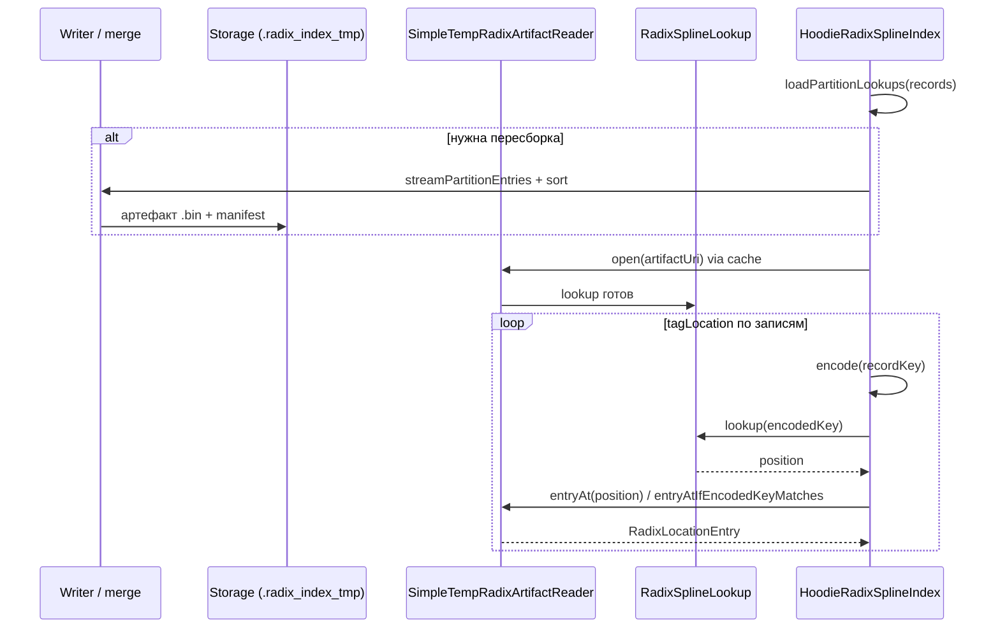
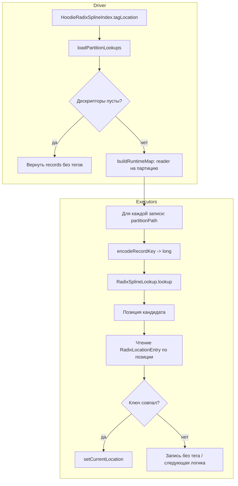
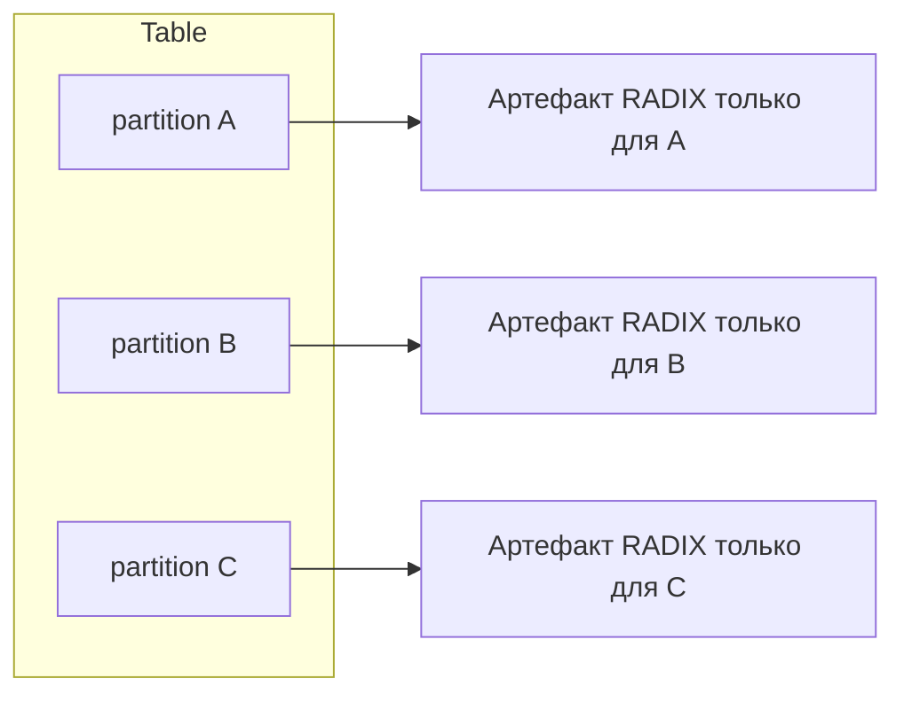

# RADIX_SPLINE index (Hudi Spark)

Документация по **индексу Radix Spline** в Spark-клиенте: назначение, включение, конфигурация, поток данных, артефакты на диске и ограничения. Реализация: `HoodieRadixSplineIndex` и сопутствующие классы в этом пакете.

---

## 1. Назначение

**RADIX_SPLINE** — индекс для **tag location** (привязки входящих записей к уже существующим base-файлам) на запись **upsert/insert**: по **partition path** и **record key** находится кандидатная локация (`HoodieRecordLocation`), если ключ присутствует в построенном по партиции **sorted radix spline** индексе.

- Индекс **не глобальный** (`isGlobal() == false`): модель строится **внутри каждой партиции** таблицы.
- Работает на пути Spark: фабрика `SparkHoodieIndexFactory` создаёт `HoodieRadixSplineIndex`, когда `hoodie.index.type = RADIX_SPLINE`.

---

## 2. Предварительные условия

### 2.1 Record key

- В конфиге должен быть задан **ровно один** `hoodie.datasource.write.recordkey.field` (или эквивалент через `KeyGeneratorOptions.RECORDKEY_FIELD_NAME`). Составные ключи через запятую **не поддерживаются** — см. `ensureKeyEncoderInitialized()` в `HoodieRadixSplineIndex`.

### 2.2 Схема записи

- В `HoodieWriteConfig` должна быть **write schema** (Avro JSON): без неё кодирование ключа не инициализируется.

### 2.3 Допустимые значения ключа

`RadixSplineKeyEncoder` переводит строковое представление record key в **неотрицательный long** в «каноническом десятичном» виде:

- допустимо `"0"` или `[1-9][0-9]*` без ведущих нулей (кроме `"0"`), без `+`, значение должно помещаться в **signed long**;
- поддерживаются целочисленные поля и строки с таким десятичным содержимым.

Логические типы Avro для поля ключа и сложные union-схемы для ключа **не поддерживаются** (ошибка при инициализации энкодера).

---

## 3. Включение индекса

**Свойство:** `hoodie.index.type` = `RADIX_SPLINE`

Пример через builder:

```java
HoodieWriteConfig.newBuilder()
    .withPath(tablePath)
    .withSchema(schemaString)
    .withIndexConfig(
        HoodieIndexConfig.newBuilder()
            .withIndexType(HoodieIndex.IndexType.RADIX_SPLINE)
            .build())
    .build();
```

Или через Properties / Spark:

```properties
hoodie.index.type=RADIX_SPLINE
```

Остальные параметры radix — см. раздел 4.

---

## 4. Конфигурация (ключи и значения по умолчанию)

Все ключи объявлены в `HoodieIndexConfig`; доступ через `HoodieWriteConfig` / builder.

| Ключ | По умолчанию | Смысл |
|------|----------------|--------|
| `hoodie.index.radix_spline.max_error` | `8` | Допустимая ошибка сплайна (точность модели относительно отсортированных ключей). |
| `hoodie.index.radix_spline.radix_bits` | `10` | Число бит radix-части модели (ограничивает структуру radix-слоя). |
| `hoodie.index.radix_spline.max_entries_per_partition` | `0` | Максимум записей в одной партиции при **сборке** артефакта; `0` = без лимита; превышение — fail-fast (защита от OOM). |
| `hoodie.index.radix_spline.merge_max_entries_in_memory` | `100000` | Размер чанка in-memory при внешней сортировке/слиянии при сборке артефакта; должно быть `> 0`. |
| `hoodie.index.radix_spline.profile_tag_location` | `false` | При `true` — дополнительные агрегированные тайминги в логах на задачу при `tagLocation`. |
| `hoodie.index.radix_spline.lookup_window_keys` | `4096` | Размер окна ключей для read-ahead при бинарном поиске в lookup; должно быть `> 0`. |
| `hoodie.index.radix_spline.lookup_window_adaptive` | `false` | Адаптивное изменение окна после калибровки. |
| `hoodie.index.radix_spline.lookup_window_adaptive_min` | `1024` | Нижняя граница окна при adaptive. |
| `hoodie.index.radix_spline.lookup_window_adaptive_max` | `16384` | Верхняя граница окна при adaptive. |
| `hoodie.index.radix_spline.lookup_window_adaptive_calibration_keys` | `4096` | Число probe’ов для калибровки adaptive-окна. |

Builder-хелперы: `HoodieWriteConfig.Builder.withRadixSplineIndexMaxError`, `withRadixSplineIndexRadixBits`, `withRadixSplineMaxEntriesPerPartition`, `withRadixSplineMergeMaxEntriesInMemory`, `withRadixSplineProfileTagLocation`, и т.д. (см. `HoodieWriteConfig`).

---

## 5. Архитектура и размещение данных

### 5.1 Где лежат файлы

Базовый каталог таблицы: `<basePath>`.

Упрощённое дерево (имена промежуточных каталогов см. в коде writer/publisher):

```text
<basePath>/
  .hoodie/
    .radix_index_tmp/
      instants/<instant>/<partition-encoded>/*.bin    # артефакты spline
      .writer_scratch/                                 # локальный spill при file://
      latest/*.properties                             # указатели на последний артефакт партиции (где применимо)
```

- **Staging / артефакты партиций:** `<basePath>/.hoodie/.radix_index_tmp/`  
  (для записи временных файлов writer использует подкаталог `.writer_scratch/` под этим корнем для `file:`-таблиц; для нелокальных схем spill может уходить в `java.io.tmpdir` — см. javadoc `HoodieRadixSplineIndex.resolveLocalWriterScratchDir`).
- **Манифесты «latest»** для дескрипторов партиций поддерживаются логикой загрузки (properties с путём к артефакту, диапазоном ключей, fingerprint базовых файлов и т.д.).
- При наличии соответствующей **metadata partition** возможна загрузка manifest из metadata table (см. код `tryLoadLatestDescriptor` / `MetadataPartitionType.RADIX_SPLINE_INDEX`).

### 5.2 Кэш читателей

`RadixArtifactReaderCache` держит открытые `TempRadixArtifactReader` по ключу артефакта и параметрам lookup-window (TTL простоя ~5 минут). Это снижает стоимость повторных открытий файла при многих записях в одной партиции.

---

## 6. Как это работает: общая схема

### 6.0 Рисунок: от записи до локации (сквозной поток)

Ниже — **ASCII-схема** полного цикла на одной партиции (драйвер + задачи могут быть распределены по Spark; логика та же).

```text
                    ┌─────────────────────────────────────────────────────────┐
                    │              Входной батч HoodieData                       │
                    │         (partitionPath + recordKey на запись)              │
                    └───────────────────────────┬─────────────────────────────┘
                                                │
                        ┌───────────────────────┴───────────────────────┐
                        │ loadPartitionLookups (driver)                │
                        │ • уникальные partitionPath из записей        │
                        │ • на каждую: descriptor + путь к .bin        │
                        └───────────────────────┬───────────────────────┘
                                                │
          ┌─────────────────────────────────────┼─────────────────────────────────────┐
          │ нет актуального артефакта / сменился │ fingerprint base-файлов             │
          ▼                                       │                                     │
    ┌───────────────┐                             │                                     │
    │ stream keys   │                             │                                     │
    │ merge sort    │                             │                                     │
    │ spline build  │                             │                                     │
    └───────┬───────┘                             │                                     │
            │                                     │                                     │
            ▼                                     ▼                                     │
    ┌───────────────────────────┐       ┌───────────────────────────┐                  │
    │ SimpleTempRadixArtifactWriter │     │ RadixArtifactReaderCache │                  │
    │  → артефакт .bin           │       │  getOrOpen(descriptor)    │                  │
    └───────────┬───────────┘           └───────────┬───────────┘                     │
                │                                   │                                   │
                └───────────────────┬───────────────┘                                   │
                                    │                                                   │
                                    ▼                                                   │
                         ┌─────────────────────┐                                        │
                         │ TempRadixArtifactReader                                        │
                         │ + RadixSplineLookup                                            │
                         └──────────┬──────────┘                                       │
                                    │                                                   │
        по каждой записи с партицией P ─────────────────────────────────────────────────►│
                                    │                                                   │
                                    ▼                                                   │
                         encode(recordKey) → long                                       │
                                    │                                                   │
                                    ▼                                                   │
                         lookup(encodedKey) → позиция                                    │
                                    │                                                   │
                                    ▼                                                   │
                         entryAt / entryAtIfEncodedKeyMatches → RadixLocationEntry       │
                                    │                                                   │
                                    ▼                                                   │
                         setCurrentLocation(HoodieRecordLocation)                      │
                                    │                                                   │
                                    ▼                                                   │
                         ┌─────────────────────┐                                        │
                         │ записи без тега:     │  нет позиции / ключ не совпал /       │
                         │ пропуск или upsert   │  нет descriptor для партиции          │
                         └─────────────────────┘                                        │
```

### 6.0b Sequence: взаимодействие компонентов (Mermaid)



### 6.0c Упрощённый flowchart `tagLocation` (driver vs executors)

Упрощённый поток **`tagLocation`** (без деталей профилирования и всех веток ошибок).



### 6.1 Откуда берётся множество партиций для lookup

`loadPartitionLookups` **не** сканирует все партиции таблицы на FS. Оно собирает **уникальные `partitionPath`** из **входного** `HoodieData` (через `mapPartitions` по записям), затем параллельно строит `PartitionLookupDescriptor` для каждой затронутой партиции. Поэтому для lookup учитываются только партиции, реально присутствующие во входном батче.

### 6.2 Сборка индекса при необходимости

Если актуальный артефакт/манифест для состояния base-файлов партиции отсутствует или не консистентен, индекс **пересобирается**: поток записей партиции читается через `streamPartitionEntries` / merge sort, пишется бинарный артефакт `SimpleTempRadixArtifactWriter`, обновляются манифесты. Детали выбора radix-бит, сплайна и лимитов — в `SimpleTempRadixArtifactWriter` и вызывающем коде `HoodieRadixSplineIndex`.

### 6.3 Индекс «по партициям» таблицы



Запись с `partitionPath = B` участвует только в lookup для **B**; глобального смешения ключей между партициями нет.

---

## 7. Бинарный артефакт (обзор)

Реализация writer: `SimpleTempRadixArtifactWriter`.

- **Magic:** `0x52534958` (`RSIX`), **версия формата:** сейчас **4** (`VERSION`), есть наследие 2/3 для старых файлов.
- Файл содержит: заголовок с метаданными (число записей, min/max ключа, длины spline/radix блоков, смещения секций), модель **radix spline**, массив ключей, offsets на записи, секцию записей (encoded key, record key, локация; в v4 — словари для instant/fileId).

Читатель: `SimpleTempRadixArtifactReader.open(artifactUri, storageConf, …)` строит `RadixSplineLookup` для поиска позиции по закодированному ключу и позволяет прочитать `RadixLocationEntry` по индексу.

Оптимизация: при совпадении закодированного ключа можно не разбирать запись полностью до проверки — см. `entryAtIfEncodedKeyMatches` в `SimpleTempRadixArtifactReader` (использование из `tagLocation` может идти через проверку типа reader; для «чистого» API возможен вынос в метод интерфейса `TempRadixArtifactReader` — см. обсуждение дизайна).

---

## 8. Основные типы в пакете

| Тип | Роль |
|-----|------|
| `HoodieRadixSplineIndex` | Реализация `HoodieIndex`: `tagLocation`, сборка/загрузка дескрипторов, rollback staging. |
| `RadixSplineKeyEncoder` | Кодирование record key → long. |
| `PartitionLookupDescriptor` | Дескриптор партиции: путь, URI артефакта, min/max ключ, fingerprint базовых файлов и пр. |
| `TempRadixArtifactWriter` / `SimpleTempRadixArtifactWriter` | Запись артефакта. |
| `TempRadixArtifactReader` / `SimpleTempRadixArtifactReader` | Чтение артефакта и lookup. |
| `RadixSplineLookup` | Поиск диапазона/позиции по закодированному ключу. |
| `RadixArtifactReaderCache` | Кэш открытых readers. |
| `RadixLocationEntry` | Одна строка индекса: encoded key, record key, `HoodieRecordLocation`. |

---

## 9. Rollback и согласованность

`rollbackCommit(String)` чистит staging для откатываемого инстанта и устаревшие `latest/*.properties`, чтобы не оставались «висячие» указатели на артефакты. Даже если очистка частично не удалась, следующий `tagLocation` опирается на **fingerprint** актуальных base-файлов и при необходимости **перестраивает** артефакт.

---

## 10. Ограничения и типичные проблемы

| Симптом | Возможная причина |
|---------|-------------------|
| Ошибка инициализации энкодера | Нет schema / неверный `recordkey.field` / составной ключ / неподдерживаемый тип поля ключа. |
| Запись не тегируется (**ключ и домен**) | Record key не в canonical decimal, не помещается в `long`, или в партиции конфликтуют два разных ключа с одним и тем же encoded key (дубликат в домене индекса). |
| Запись не тегируется (**этап lookup**) | `RadixSplineLookup` не вернул кандидатную позицию для этого encoded key в текущем артефакте партиции — до чтения записи из файла выполнение не доходит. |
| Запись не тегируется (**верификация после lookup**) | Позиция от lookup есть, но при чтении артефакта encoded key в байтах записи ≠ ожидаемому (`entryAtIfEncodedKeyMatches` → отказ): защита от ложного совпадения по границам модели/окна; снаружи это тоже «нет тега». |
| Большая память при сборке | Уменьшить `merge_max_entries_in_memory` или задать `max_entries_per_partition`. |
| Медленный lookup | Играть `lookup_window_*`; включить профилирование `profile_tag_location`. |

Под «запись не тегируется» здесь имеется в виду один и тот же **видимый симптом** (локация из RADIX не проставлена); строки различают **на каком шагу пайплайна** это произошло — это подсказка для отладки, а не перечень недостатков индекса.

---

## 11. Тестирование

Пакет тестов: `hudi-client/hudi-spark-client/src/test/java/org/apache/hudi/index/radix/`.

### 11.1 Интеграционные / сценарные (Spark, таблица, write client)

| Класс | Что проверяет |
|-------|----------------|
| `TestHoodieRadixSplineIndex` | Базовый `tagLocation`, сопоставление записей с локациями. |
| `TestHoodieRadixSplineIndexWritePath` | Путь записи с индексом. |
| `TestHoodieRadixSplineIndexReuse` | Повторное использование построенного артефакта. |
| `TestHoodieRadixSplineIndexTagLocationReuse` | Повторный `tagLocation`, моки таблицы: один раз сборка stream, затем reuse; смена состояния партиции пересборка. |
| `TestHoodieRadixSplineIndexRollback` / `TestHoodieRadixSplineIndexWriteClientRollback` | Откат коммита и согласованность staging. |
| `TestHoodieRadixSplineIndexSchemaContract` | Контракт схемы record key и энкодера. |

### 11.2 Юнит-тесты структур данных и алгоритмов

| Класс | Что проверяет |
|-------|----------------|
| `TestRadixSplineModel`, `TestRadixSplineLookup`, `TestSearchBound` | Модель сплайна и поиск границ. |
| `TestRadixSplineKeyEncoder` | Кодирование ключей. |
| `TestSeekableWindowedKeyAccessor`, `TestLongFileSortedKeyAccessor` | Оконный доступ к ключам на seekable-потоке. |
| `TestLocationLookupResult` | Результат lookup. |
| `TestExternalMergeRadixEntrySorter` | Внешнее слияние записей при сборке. |

### 11.3 Кэш читателя и формат артефакта

| Класс | Что проверяет |
|-------|----------------|
| `TestRadixArtifactReaderCache` | Кэш readers, eviction, rollback по инстанту; хелпер `writeOneEntryArtifactForTest`; лимит `max_entries_per_partition`; **`testEntryAtIfEncodedKeyMismatchReturnsNullMatchReturnsFullEntry`** — mismatch encoded key → `null`, совпадение → полный `RadixLocationEntry`. |

### 11.4 Загрузка партиций для lookup

| Класс | Что проверяет |
|-------|----------------|
| `TestHoodieRadixSplineIndexLoadPartitionLookups` | Множество партиций для lookup совпадает с **уникальными** `partitionPath` из входного `HoodieData` (без сканирования всех партиций таблицы). |

---

## 12. Микробенчмарки (stdout, не «нагрузочные» тесты кластера)

Это обычные JUnit-тесты, которые дополнительно печатают в **stdout** время и throughput. Их имеет смысл гонять локально при настройке окна lookup или буферов открытия артефакта.

### 12.1 `TestRadixLookupWindowMicroBenchmark`

**Идея:** в памяти строится отсортированный массив ключей, по нему — `RadixSplineModel`, затем два варианта `RadixSplineLookup`:

- **fixed** — `RadixLookupWindowParams.fixed(4096)` (как типичный прод-режим с фиксированным окном);
- **adaptive** — параметры с калибровкой (`RadixLookupWindowParams` с adaptive min/max).

После проверки совпадения позиций с эталоном (`refLookup`) выполняется симметричный JIT-warmup (чередование fixed/adaptive), затем два замера каждого варианта и вывод **среднего времени** и отношения adaptive/fixed.

**Методы:**

| Метод | Назначение |
|-------|------------|
| `printFixedVsAdaptiveLookupTimings` | Основной вывод `[radix-window-microbench] avg fixed ... avg adaptive ... ratio`. |

**Системные свойства JVM** (через `-D` к `mvn`, см. **приложение A.5**):

| Свойство | По умолчанию | Смысл |
|----------|----------------|-------|
| `radix.microbench.n` | `120000` | Число ключей в синтетическом массиве. |
| `radix.microbench.warmup` | `25000` | Прогрев до замера (число lookup в фазе discard и внутри фазы измерения — см. код). |
| `radix.microbench.timed` | `120000` | Сколько lookup попадает в секцию с таймером для строки `... s for N lookups => ... lookups/s`. |

### 12.2 `TestRadixArtifactOpenScratchMicroBenchmark`

**Идея:** при открытии артефакта массивы long/int читаются с диска; `RadixArtifactOpenScratch` переиспользует буферы вместо аллокаций на каждый массив. Бенч сравнивает **allocating** baseline и **scratch** на большом синтетическом payload.

**Методы:**

| Метод | Назначение |
|-------|------------|
| `scratchMatchesAllocatingBaseline` | Корректность: массивы из scratch совпадают с baseline. |
| `printAllocVsScratchTimings` | Вывод `[radix-open-scratch-microbench] allocating: ... s; scratch: ... s; ratio scratch/alloc: ...`. |

**Системные свойства JVM:**

| Свойство | По умолчанию | Смысл |
|----------|----------------|-------|
| `radix.open.microbench.longCount` | `50000` | Число long в payload. |
| `radix.open.microbench.intCount` | `50000` | Число int в payload. |
| `radix.open.microbench.warmup` | `30` | Итераций прогрева. |
| `radix.open.microbench.timed` | `80` | Итераций в замере. |

### 12.3 Сравнение типов индексов под нагрузкой (`IndexScaleComparisonBenchmark`)

Класс: `org.apache.hudi.index.radix.IndexScaleComparisonBenchmark`.

**Не входит в обычный прогон тестов.** Запуск только с системным свойством `-Dbenchmark.enabled=true`.

Что делает для каждой комбинации «тип инд × число строк»:

1. Чистая таблица на диске (`metadata table` выключена для простоты учёта места).
2. **Bulk insert** N синтетических записей (ключ `_row_key` = `"0"` … `"N-1"` в canonical decimal, одна партиция); без материализации N ключей на driver — диапазон через `SparkSession.range`.
3. **Upsert** тех же N ключей (обновление поля `fare`) — проходит **tag location** и для RADIX вызывает сборку/использование артефакта под `.hoodie/.radix_index_tmp/`.

В **stdout** печатается таблица:

| Колонка | Смысл |
|---------|--------|
| `rows` | N |
| `wall_sec` | суммарное время bulk insert + upsert в одном прогоне |
| `total_mb` | размер всего каталога таблицы |
| `hoodie_mb` | размер каталога `.hoodie` (таймлайн, служебные файлы) |
| `radix_tmp_mb` | размер `.hoodie/.radix_index_tmp` (для **RADIX_SPLINE**; для Bloom/Simple обычно ~0) |
| `data_mb*` | приближённо `total − .hoodie` — данные партиций (Parquet и т.д.); **Bloom-фильтры лежат внутри файлов данных**, отдельной колонки нет |

Свойства JVM:

| Свойство | По умолчанию |
|----------|----------------|
| `benchmark.scales` | `100000,500000,1000000,5000000,10000000` |
| `benchmark.indexes` | `BLOOM,SIMPLE,RADIX_SPLINE` |
| `benchmark.maxScale` | без ограничения; задайте, например `1000000`, чтобы не гонять большие объёмы случайно |

Большие N (миллионы) требуют **heap driver/executor**, диска и времени; начинайте с `-Dbenchmark.maxScale=100000`.

Команда пример — см. **приложение A.8**.

---

## 13. Версионирование документа

Текст описывает поведение кода в дереве рядом с этим файлом. При апстриме в Apache Hudi проверьте актуальность ключей в `HoodieIndexConfig` и комментарии в `HoodieRadixSplineIndex`.

---

## Приложение A. Команды сборки, тестов и микробенчмарков

Рабочая директория — **корень репозитория** (`hudi`), если не указано иначе. Разделитель путей Maven для Windows используйте как принято в вашей оболочке.

### A.1 Переменные окружения

Рекомендуется выставить **JDK 17** для Maven, если в репозитории включён профиль по файлу `.mvn/enforce-java17` (иначе `maven-enforcer-plugin` может завершить сборку с сообщением о необходимости JDK 17).

```bash
export JAVA_HOME="$(/usr/libexec/java_home -v 17)"   # macOS, пример
# export JAVA_HOME=/path/to/jdk-17                      # Linux / вручную
```

Целевая версия **bytecode** проекта задаётся в корневом `pom.xml` (`java.version`); отдельно от версии JDK для запуска Maven.

### A.2 Сборка модуля без тестов (быстро проверить компиляцию)

С зависимостями модулей по реактору (`-am` = also make):

```bash
mvn -pl hudi-client/hudi-spark-client -am -DskipTests package
```

Только компиляция тестовых классов:

```bash
mvn -pl hudi-client/hudi-spark-client -am -DskipTests package test-compile
```

### A.3 Полный прогон тестов модуля `hudi-spark-client`

Тяжёлый по времени (много Spark/Hadoop-тестов во всём модуле):

```bash
mvn -pl hudi-client/hudi-spark-client -am test
```

Если enforcer блокирует из‑за JDK:

```bash
mvn -pl hudi-client/hudi-spark-client -am -Denforcer.skip=true test
```

Если нужно собрать зависимости без обязательных тестов промежуточных модулей:

```bash
mvn -pl hudi-client/hudi-spark-client -am -DfailIfNoTests=false test
```

### A.4 Только тесты пакета `org.apache.hudi.index.radix`

Surefire принимает шаблон имён классов. Пример — все классы, начинающиеся с `TestRadix`:

```bash
mvn -pl hudi-client/hudi-spark-client -am -Denforcer.skip=true \
  -DfailIfNoTests=false \
  -Dtest='TestRadix*,TestHoodieRadixSpline*,TestSeekable*,TestExternalMerge*,TestLocationLookup*,TestLongFile*,TestSearchBound*' \
  test
```

Уточнить один класс:

```bash
mvn -pl hudi-client/hudi-spark-client -am -Denforcer.skip=true \
  -Dtest=TestRadixArtifactReaderCache \
  test
```

Один метод:

```bash
mvn -pl hudi-client/hudi-spark-client -am -Denforcer.skip=true \
  -Dtest=TestRadixLookupWindowMicroBenchmark#printFixedVsAdaptiveLookupTimings \
  test
```

### A.5 Микробенчмарки с параметрами JVM

Параметры передаются в **fork JVM** Surefire через обычные `-D` к `mvn` (в типичной установке они становятся system properties тестового процесса):

```bash
mvn -pl hudi-client/hudi-spark-client -am -Denforcer.skip=true \
  -Dradix.microbench.timed=60000 \
  -Dradix.microbench.warmup=30000 \
  -Dtest=TestRadixLookupWindowMicroBenchmark#printFixedVsAdaptiveLookupTimings \
  test
```

Открытие артефакта (scratch vs allocating):

```bash
mvn -pl hudi-client/hudi-spark-client -am -Denforcer.skip=true \
  -Dradix.open.microbench.timed=100 \
  -Dtest=TestRadixArtifactOpenScratchMicroBenchmark#printAllocVsScratchTimings \
  test
```

Если свойства не доходят до тестов, пробуйте явный `argLine` Surefire:

```bash
mvn -pl hudi-client/hudi-spark-client -am -Denforcer.skip=true \
  -DargLine="-Dradix.microbench.n=200000" \
  -Dtest=TestRadixLookupWindowMicroBenchmark#printFixedVsAdaptiveLookupTimings \
  test
```

Вывод смотрите в логе surefire в консоли и при необходимости в `hudi-client/hudi-spark-client/target/surefire-reports/`.

### A.6 Установка артефакта в локальный `.m2` (без тестов)

```bash
mvn -pl hudi-client/hudi-spark-client -am -DskipTests install
```

### A.7 Замечания по окружению

- Часть тестов поднимает **Spark** и **Hadoop FileSystem**. На очень новых JDK (например 23+) возможны ограничения совместимости Hadoop/Mockito/Byte Buddy; эталон для проекта обычно — **JDK 17**, как у многих сборок Hudi.
- Для надёжного прогона radix integration-тестов используйте ту же JDK, что и в CI проекта.

### A.8 Бенчмарк сравнения индексов (`IndexScaleComparisonBenchmark`)

Только при `-Dbenchmark.enabled=true`. Рекомендуется ограничить масштаб при первых прогонах:

```bash
mvn -pl hudi-client/hudi-spark-client -am -Denforcer.skip=true \
  -Dbenchmark.enabled=true \
  -Dbenchmark.maxScale=500000 \
  -Dtest=IndexScaleComparisonBenchmark \
  test
```

Все заявленные масштабы и три индекса по умолчанию (очень долго и тяжело по диску):

```bash
mvn -pl hudi-client/hudi-spark-client -am -Denforcer.skip=true \
  -Dbenchmark.enabled=true \
  -Dtest=IndexScaleComparisonBenchmark \
  test
```

Только RADIX и один масштаб:

```bash
mvn -pl hudi-client/hudi-spark-client -am -Denforcer.skip=true \
  -Dbenchmark.enabled=true \
  -Dbenchmark.scales=1000000 \
  -Dbenchmark.indexes=RADIX_SPLINE \
  -Dtest=IndexScaleComparisonBenchmark \
  test
```
